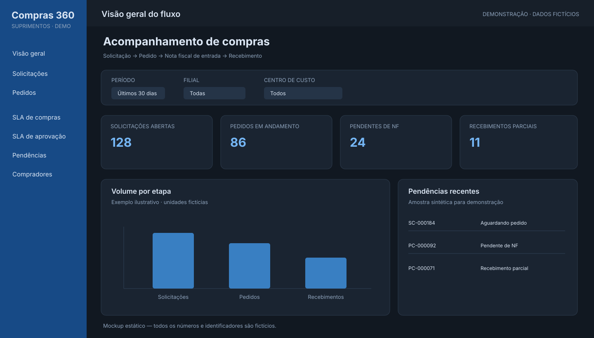
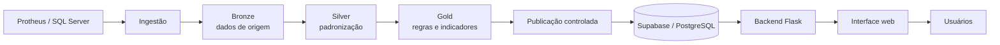

# Plataforma de Controle de Compras

Plataforma de acompanhamento do ciclo de compras, da solicitação ao recebimento, com foco em rastreabilidade, visibilidade operacional e indicadores de prazo.

> **Edição de portfólio.** Este repositório apresenta a arquitetura e as decisões técnicas do projeto por meio de documentação e artefatos demonstrativos. Não contém código, dados ou configurações do ambiente corporativo. Os números e registros exibidos nas imagens são fictícios.



## Visão do produto

O sistema organiza o acompanhamento do fluxo de compras em etapas relacionadas:

1. **Solicitação de compra (SC):** registro e acompanhamento da demanda.
2. **Pedido de compra (PC):** vínculo da solicitação ao pedido emitido.
3. **Nota fiscal de entrada (NF):** acompanhamento do recebimento e da situação documental.

A proposta é oferecer uma visão consolidada do processo, permitindo identificar solicitações sem pedido, pedidos pendentes de nota fiscal e recebimentos parciais, além de apoiar a análise de prazos e pendências.

## Funcionalidades contempladas

- Visão geral do fluxo de compras e seus principais indicadores.
- Consulta de solicitações e pedidos com filtros por período e atributos operacionais.
- Rastreamento do vínculo entre solicitação e pedido.
- Acompanhamento de recebimento e pendências de documentação fiscal.
- Indicadores de SLA de compras e de aprovação.
- Visões de análise por comprador, centro de custo e fornecedor.
- Atualização de dados publicada em camada de consumo, com indicação de frescor.

## Arquitetura

A solução separa ingestão, transformação, publicação e experiência de usuário. O desenho abaixo representa o fluxo lógico da edição de portfólio; detalhes de implantação e segurança estão em [`docs/architecture.md`](docs/architecture.md).



### Tecnologias

| Camada | Tecnologia | Responsabilidade |
|---|---|---|
| Origem | TOTVS Protheus / SQL Server | Sistema transacional de compras |
| Engenharia de dados | Microsoft Fabric, Lakehouse e PySpark | Ingestão e transformação por camadas |
| Persistência de consumo | Supabase / PostgreSQL | Disponibilização dos dados para a aplicação |
| Backend | Python / Flask / Jinja | Rotas, regras de aplicação e renderização no servidor |
| Frontend | Next.js | Componentes e experiência web |
| Hospedagem | Azure VM | Execução dos serviços de aplicação |
| CI/CD | GitHub Actions | Automação de validações e publicação de versões |

A tabela acima descreve a arquitetura de referência do projeto. A edição pública não inclui credenciais, endpoints privados, arquivos de configuração de produção ou dados operacionais.

## Modelo de dados

O modelo acompanha as entidades centrais do processo: solicitação, pedido, fornecedor, produto, centro de custo e documento fiscal. Os nomes de tabelas abaixo são referências de origem; não há linhas de dados neste repositório.

| Processo | Tabelas Protheus de referência |
|---|---|
| Solicitações de compra | `SC1010` |
| Pedidos de compra | `SC7010` |
| Cabeçalho de nota fiscal de entrada | `SF1010` |
| Itens de nota fiscal de entrada | `SD1010` |
| Fornecedores | `SA2010` |
| Produtos | `SB1010` |
| Centros de custo | `CTT010` |
| Plano de contas | `CT1010` |
| Usuários | `SYS_USR` |

Os relacionamentos e as regras de negócio são descritos em [`docs/data-model.md`](docs/data-model.md). A estrutura real pode variar conforme parametrização e customizações do ambiente Protheus.

## Organização do repositório

```text
.
├── README.md
├── assets/
│   ├── architecture.svg
│   └── dashboard-demo.svg
└── docs/
    ├── architecture.md
    ├── data-model.md
    ├── security-and-privacy.md
    └── decisions.md
```

## Execução e demonstração

Este repositório é uma apresentação técnica e documental. Ele não é um pacote executável da aplicação corporativa e não contém dependências ou configurações suficientes para conectar a uma instância real.

A imagem da interface é um mockup estático, criado para demonstrar a organização das informações sem reproduzir dados reais. Os valores, nomes e estados apresentados são ilustrativos.

## Segurança e privacidade

- Nenhuma credencial, segredo, arquivo `.env` ou conexão corporativa é publicado.
- Nenhum registro real de solicitação, pedido, fornecedor ou nota fiscal é incluído.
- Os artefatos visuais usam dados inteiramente fictícios.
- Os nomes das tabelas são documentados apenas como referência técnica.
- A edição de portfólio é independente do ambiente de produção.

Consulte [`docs/security-and-privacy.md`](docs/security-and-privacy.md) antes de adicionar qualquer novo artefato.

## Escopo da edição pública

O objetivo deste repositório é demonstrar a concepção da solução, a arquitetura de dados, a integração entre serviços e a experiência de acompanhamento do processo. Ele não pretende ser uma cópia implantável do sistema corporativo nem expor sua implementação proprietária.

## Licença

A documentação e os artefatos demonstrativos deste repositório são disponibilizados sob a licença MIT. A licença não concede direitos sobre marcas, sistemas ou dados de terceiros mencionados como contexto técnico.
