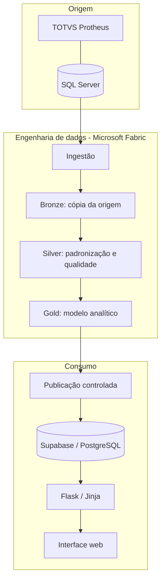
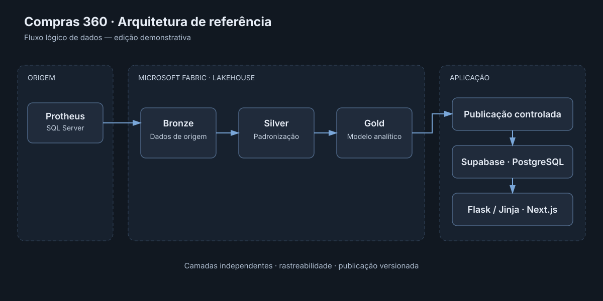

# Arquitetura de referência

## Objetivo

A arquitetura organiza o ciclo de dados em etapas independentes: extração da origem, armazenamento histórico, transformação, publicação para consumo e apresentação na aplicação. A separação reduz o acoplamento entre o sistema transacional e as consultas analíticas.

## Visão lógica

## Responsabilidades por camada

### Origem transacional

O Protheus mantém os registros operacionais. A extração analítica deve respeitar a disponibilidade da origem, os limites de leitura e as regras de acesso. A camada de consumo não deve executar consultas analíticas pesadas diretamente contra o ERP.

### Bronze

Armazena a representação inicial dos dados extraídos, preservando rastreabilidade da carga. Metadados de execução e identificação de lote permitem investigar a origem de uma publicação.

### Silver

Aplica padronização de tipos, tratamento de valores, normalização de chaves e verificações de consistência. A transformação deve tornar explícitas as regras de qualidade, sem esconder registros inválidos silenciosamente.

### Gold

Organiza os dados em estruturas orientadas ao processo de compras e às consultas da aplicação. É a camada apropriada para consolidar o vínculo entre solicitação, pedido e recebimento e calcular indicadores derivados.

### Publicação e serving

A publicação transfere um conjunto identificado de dados para o banco de consumo. O processo deve ser idempotente ou possuir estratégia explícita de substituição, registrar o lote e permitir detectar falhas sem apresentar uma carga incompleta como atualizada.

### Aplicação

O backend Flask atende às rotas da aplicação e compõe páginas com Jinja. A interface Next.js fornece componentes e experiência web. O banco de consumo é a fronteira entre os dados publicados e as consultas da aplicação.

## Atualização e observabilidade

A atualização deve ser tratada como um fluxo verificável, não apenas como uma tarefa agendada. Recomenda-se registrar, por execução:

- identificador do lote e horário de início/fim;
- etapa executada e resultado;
- quantidade de registros processados, quando disponível;
- versão ou referência do snapshot de origem;
- mensagem técnica sanitizada em caso de falha.

A interface pode exibir o horário da última publicação bem-sucedida. Esse horário deve refletir a carga efetivamente disponibilizada, e não somente o início de uma execução.

## Segurança

Credenciais e endpoints privados pertencem à configuração do ambiente e nunca ao código-fonte. O acesso às informações deve seguir o princípio do menor privilégio. A publicação pública deste repositório não inclui código de integração operacional nem configuração de produção.

## Diagrama

O diagrama SVG e o Mermaid apresentam a mesma separação lógica. São desenhos de referência, não um inventário de recursos implantados.