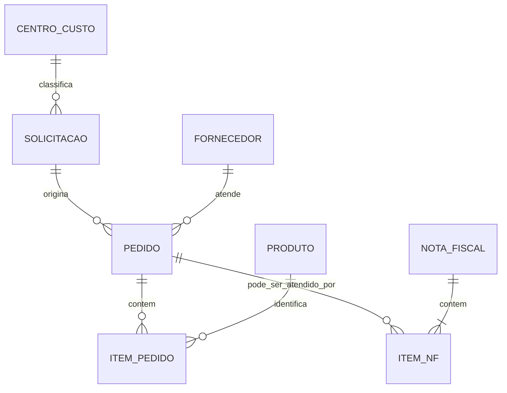

# Modelo de dados conceitual

## Escopo

O modelo representa o fluxo de compras como uma cadeia de documentos relacionados. A cardinalidade e os campos exatos dependem das regras e da parametrização do ambiente de origem; por isso, este documento descreve conceitos e não substitui o dicionário oficial do ERP.

## Entidades

| Entidade | Papel no processo | Referência de tabela Protheus |
|---|---|---|
| Solicitação de compra | Registra a necessidade de aquisição | `SC1010` |
| Pedido de compra | Formaliza a compra junto ao fornecedor | `SC7010` |
| Cabeçalho da NF de entrada | Identifica o documento fiscal recebido | `SF1010` |
| Itens da NF de entrada | Detalha os produtos/serviços recebidos | `SD1010` |
| Fornecedor | Identifica a entidade fornecedora | `SA2010` |
| Produto | Cadastro de item | `SB1010` |
| Centro de custo | Classificação gerencial | `CTT010` |
| Plano de contas | Classificação contábil | `CT1010` |
| Usuário | Cadastro de usuários do ERP | `SYS_USR` |

> Os nomes são referências de tabelas, não uma garantia de que todos os ambientes tenham o mesmo dicionário, campos ou customizações.

## Fluxo conceitual

O relacionamento entre documentos deve considerar as chaves compostas e os campos de vínculo definidos pelo ERP. O diagrama é intencionalmente conceitual e não especifica colunas físicas.

## Indicadores derivados

- **Solicitações sem pedido:** solicitações que ainda não possuem vínculo válido com pedido.
- **Pedidos sem NF:** pedidos sem documento fiscal associado, respeitando critérios de cancelamento e recebimento definidos pelo negócio.
- **Recebimento parcial:** pedido com quantidade recebida inferior à quantidade prevista, quando o dado de quantidade e a regra de unidade estiverem disponíveis.
- **SLA:** intervalo entre marcos do processo, calculado com datas de referência explicitamente definidas.

Indicadores precisam declarar seus critérios de inclusão, exclusão e data de referência. Não se deve misturar data de emissão, criação, aprovação e recebimento como se fossem equivalentes.

## Considerações de qualidade

1. Validar chaves e vínculos antes de consolidar documentos.
2. Tratar exclusões lógicas e documentos cancelados conforme regra de negócio documentada.
3. Verificar duplicidades de chave e inconsistências de quantidade.
4. Preservar a origem e o lote para permitir reconciliação.
5. Evitar inferir recebimento apenas pela existência de uma nota fiscal sem validar o vínculo e os itens.

Nenhuma linha de dados ou valor operacional é distribuído neste repositório.